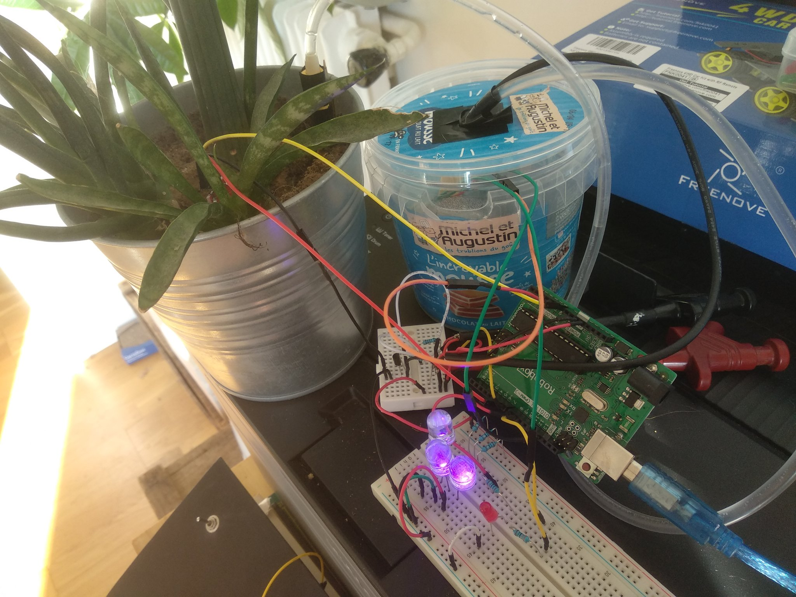
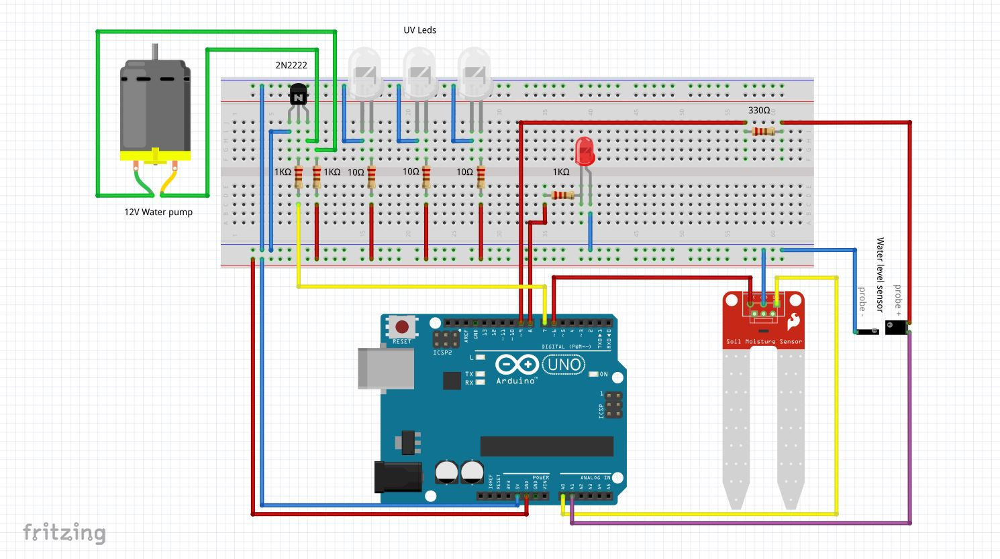

# Power Plant

Power plant is an electronics and arduino based project in order to give the possibility to a plant to stay in a sustainable environment by itself including water and light.

Disclaimer : Biological tests and researches for water and light quantity haven't been done yet, it won't work as-is for any plant.

## Tools and components

- 1 Arduino Uno + Cable
- 1 DC Water pump + pipe
- 3 UV Leds
- 1 Red led
- 1 2N2222 NPN Transistor
- 1 Funduino Soil moister sensor
- Some wires and a breadboard
- 1 330ohms resistor (pull-up)
- 1 1Komhs resistor (led)
- 3*10ohms resistors (uv leds)
- 2 1k ohms (transistor)

## How does it work ?

Each hour, the software wakes up, and check the water level inside the tank and if the level is too low, it turn on the red alert led.
Then the software checks the soil moisture value, if it's under 550 (out of 1024) AND there is enough water in the tank, it will turn on the water pump until the moisture gets above 550.

For both of the water level and  the moisture sensors, they are turned on only for 10ms each hour, it's long enough for the sensor to send accurate data and it protect the probes from corrosion due to electrolysis.

The UV leds are powered on when you turn the board on as it powered by the arduino VCC.

## Circuit

If you want to open the circuit schema as an interactive board, download the Fritzing software and open circuit-sketch.fzz !
